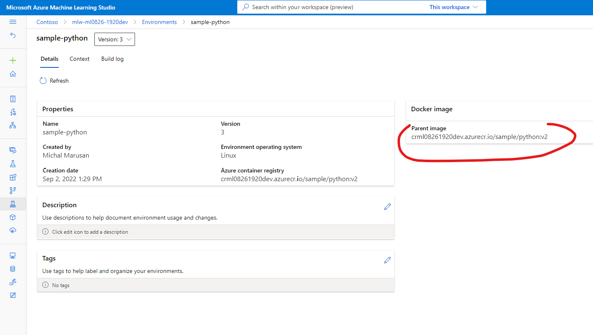

# AzureML-Custom-Docker-Image-for-Training

This simple repo demonstrates how to use your custome Docker image for training in AzureML. The docker image is infused with custom library which can run your specific code.

## Create custom package / wheel
(src: https://towardsdatascience.com/how-to-create-a-wheel-file-for-your-python-package-and-import-it-in-another-project-b09f7fbfc466)
```
📦mycode1
 ┣ 📂mycode1
 ┃ ┃ ┗ 📜__init.py__ ............ dummy
 ┃ ┃ ┗ 📜main.py ................ your code
 ┗ 📜setup.py ................... setup
```

Create a wheel distribution:
`python setup.py bdist_wheel --universal`

## Configure image in `Dockerfile`
```shell
FROM mcr.microsoft.com/azureml/openmpi3.1.2-ubuntu18.04:20220815.v1

ENV AZUREML_CONDA_ENVIRONMENT_PATH /azureml-envs/sklearn-0.24.1
# Create conda environment
RUN conda create -p $AZUREML_CONDA_ENVIRONMENT_PATH \
    python=3.7 pip=20.2.4

# Prepend path to AzureML conda environment
ENV PATH $AZUREML_CONDA_ENVIRONMENT_PATH/bin:$PATH

# Install pip dependencies
RUN pip install 'matplotlib>=3.3,<3.4' \
                'psutil>=5.8,<5.9' \
                'tqdm>=4.59,<4.60' \
                'pandas>=1.1,<1.2' \
                'scipy>=1.5,<1.6' \
                'numpy>=1.10,<1.20' \
                'ipykernel~=6.0' \
                'azureml-core==1.44.0' \
                'azureml-defaults==1.44.0' \
                'azureml-mlflow==1.44.0' \
                'azureml-telemetry==1.44.0' \
                'scikit-learn==0.24.1' \
                'pip-install-test'

# install special package
COPY mycode1-1.0-py2.py3-none-any.whl /tmp/
RUN pip install /tmp/mycode1-1.0-py2.py3-none-any.whl

# This is needed for mpi to locate libpython
ENV LD_LIBRARY_PATH $AZUREML_CONDA_ENVIRONMENT_PATH/lib:$LD_LIBRARY_PATH

```

## Build the image

Login into Azure and Azure Container registry:

`az login`
`az acr login --name crml08261920dev`

Build the image

`az acr build --image sample/python:v2 --registry crml08261920dev --file Dockerfile .`


## Create Custom environemnt in AzureML workspce studio

Create environemnt in AzureML (for example Studio, can be SDK or CLI), the parent image is the image you created in previous step:



## Use your custom image for training
```python
from azureml.core import Environment
myenv = Environment.get(workspace=ws, name="sample-python")
...
src = ScriptRunConfig(source_directory=".",
                      script="example.py",
                    #   compute_target="local",
                      compute_target="cpu-cluster",
                      environment=myenv)

run = myexp.submit(config=src)
```

while the example.py​ is really just a an instruction on usage your code/library:

```python
from mycode1.main import *

print("I am in the environment!")
train() # function from your code - the code itself is not exposed
```

Sample notebook [using-environments.ipynb](./code/using-environments.ipynb)